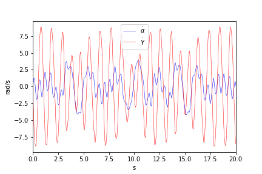
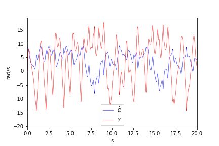
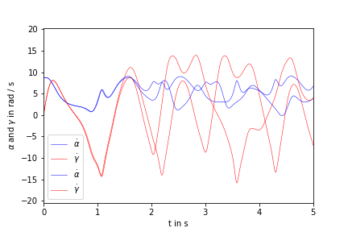

## Numerical simulation of the Rott pendulum

Numerical simulation of the Rott pendulum with the helpf of numerous numerical solvers of the underlying non-linear equations

Check out the demo.ipynb to generate the animations and plots below.

 ## Linear regime 

 ## Chaotic regime

### Sensitivity to initial conditions

